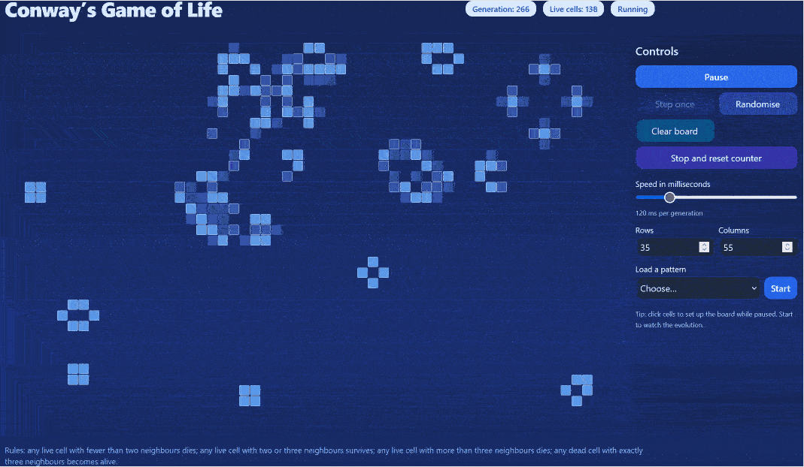

# Conway’s Game of Life — Blue (Vite + React)

The Game of Life is a cellular automaton devised by the British mathematician John Horton Conway. It is a zero-player game, meaning that its evolution is determined by its initial state, requiring no further input.



### [Live Demo Link (https://golgame.netlify.app)](https://golgame.netlify.app)


## Quick start

```bash
npm install
npm run dev
```

Open the local address shown by Vite. For Netlify, just push and set the build command to `npm run build` with publish directory `dist` (or keep `netlify.toml`).

Tailwind is loaded via CDN in `index.html`, so no extra configuration is required.